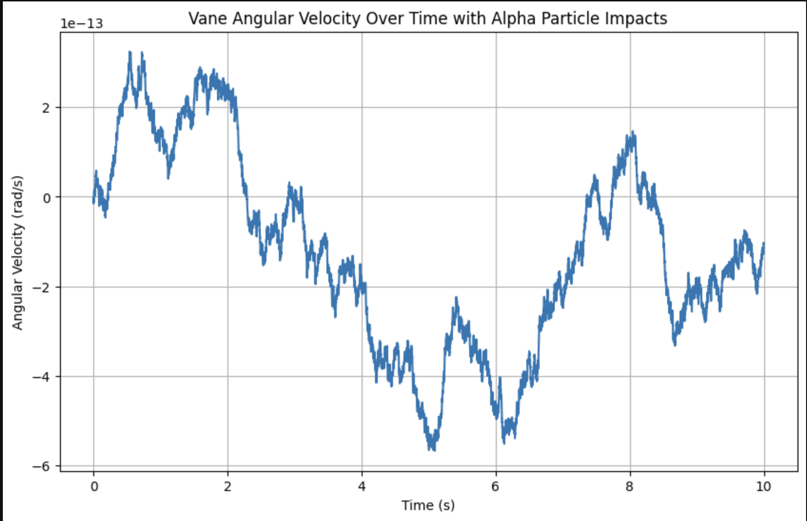

# AlphaShot

AlphaShot is a physics simulation project focused on modeling the rotational dynamics of a vane system subjected to alpha particle bombardment within a gas environment. Taking inspiration from the [Crookes radiometer](https://en.wikipedia.org/wiki/Crookes_radiometer), AlphaShot aims to determine if a vane can be effectively rotated through direct momentum transfer from MeV-scale alpha particles interacting with the vane *and* the surrounding high-pressure gas (e.g., hydrogen or helium), rather than by thermal radiation or photonic pressure.

The core objective is to simulate and analyze this alpha-driven actuation, with a secondary focus on exploring the potential for inferring alpha particle **presence, flux, and energy deposition** from the vane's resulting rotational motion. This seeks to establish a novel form of **mechanical alpha particle detection**, translating observed motion into quantitative particle flux and energy measurements.

Implemented in Python with Jupyter Notebooks, AlphaShot provides an interactive and adaptable simulation environment. Users can readily adjust key parameters such as alpha beam energy, gas composition and pressure, and vane geometry and material properties to explore a wide range of physical configurations. This facilitates the investigation of micro-scale propulsion concepts and the development of a transparent, physics-based model for alpha particle detection using mechanical systems.

## **Running the Simulation:**

1.  **Clone the repository:**
   ```bash
   git clone https://github.com/zbuhrer/alphashot
   cd alphashot
   ```

2.  **Install dependencies:** It is recommended to create a virtual environment.
    ```bash
    python3 -m venv venv

    ```bash
    source venv/bin/activate  # On a real computer
    ```

    ```bash
    venv\Scripts\activate  # On a Windows "computer"
    ```

    ```bash
    pip install -r requirements.txt
    ```

3.  **Run the Jupyter Notebook:**
    ```bash
    jupyter notebook 01_alpha.ipynb
    ```

    This will open the notebook in your web browser, allowing you to run the simulation and analyze the results yourself

## Results and Analysis



